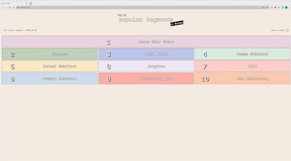

# Top 10 popular keywords searched in Norway

RSS feed which has XML file format from Google trends(https://trends.google.com/trends/trendingsearches/daily?geo=NO) is converted into JSON file. Using the Json file the single page of top 10 keywords is created.

## Techologies

- Vite : to build frontend tooling
- CSS : to style HTML document
- HTML : to display the one designed in web browser
- Javascript : to fetch data
- Netlify : to deploy the page

## Link

- Link to the project -> [Top10 search keywords](link)
- 

## Features

- Display top 10 keywords
- Link to Google showing search result for each keyword
- Reponsive design using Media queries
- Show the recent date that data from Google trends received

### What I have tried in the project

1. RSS
   -Get data from RSS feed using "fetch()" in Javascript
2. Media quary
   -Basic media quary (https://developer.mozilla.org/en-US/docs/Web/CSS/Media_Queries/Using_media_queries)
   -Responsive design to different screen sizes using CSS media queries
